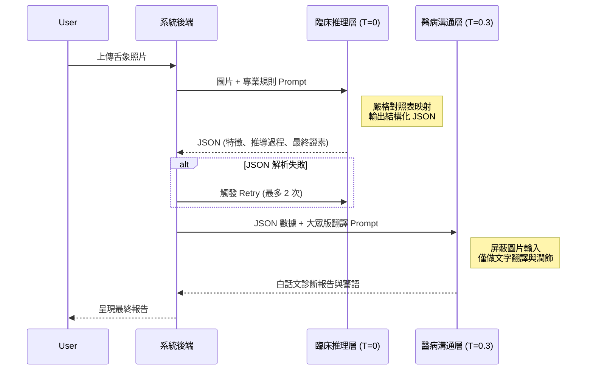

# 🔬 LLM Tuning TCM (中醫舌診參數調優框架)

這是一個基於非同步架構 (Async) 且具備嚴謹黃金標準驗證的 LLM 推理參數調優工具，專為中醫舌診場景設計。
透過 PRF1 指標與 Rule-based LLM 裁判的混合評分機制，調優產出的最佳參數，可直接匯回 [Tongue-Diagnosis 主應用](https://github.com/FJCU-AI-APPLICATION/Tongue-Diagnosis) 的設定中使用。

## 🎯 核心功能
- **非同步高併發 (Async Workflow)**：使用 `asyncio` 實作多 Worker 併發，大幅提升參數搜索效率，並支援斷點續傳。
- **混合評分與 PRF1 指標**：結合實體級 Jaccard 穩定性、Precision/Recall/F1 證素評分，以及 Rule-based LLM 裁判。
- **雙提示詞架構**：將「專業診斷推導」與「大眾白話翻譯」拆分，確保評分的科學性與客觀性。
- **自動化報告**：自動產生所有測試組合的 CSV 評分結果。

## 📁 專案結構
```text
.
├── assets/                  # 測試圖片與 ground_truth.json
├── prompts/                 # 提示詞存放區
│   ├── system_prompt_professional.md  # 專業診斷專用 (調優目標)
│   └── system_prompt_layman.md        # 白話翻譯專用
├── experiment_data/         # 實驗原始輸出紀錄
├── outputs/                 # 產生的分析報告與最佳參數配置
├── reports/                 # 綜合分析報告
├── tuning_workflow_sync.py  # 舊版同步工作流腳本
├── tuning_workflow_async.py # 新版非同步高效工作流
├── requirements.txt         # 依賴套件清單
└── pyproject.toml           # 專案配置 (支援 uv 等工具)
```

## 🏗️ 雙層推論 Pipeline 架構 (Two-Stage Architecture)

本系統為確保中醫舌診的「醫療邏輯嚴謹性」與「終端用戶可讀性」，採用解耦的雙層推論架構。



### 架構優勢與錯誤隔離策略
1. **幻覺阻斷 (Hallucination Isolation)**：Stage 2 的模型無法存取原始圖片，從根本上杜絕了翻譯階段產生新的、與 Stage 1 矛盾的病理特徵。
2. **延遲優化 (Latency Control)**：Stage 1 輸出精簡 JSON，Token 數量極少（~3s）；Stage 2 可採用串流輸出（Streaming）直達前端（TTFB < 1s），整體體感延遲小於 4 秒。
3. **優雅降級 (Graceful Degradation)**：若 Stage 2 服務超時或當機，系統可直接渲染 Stage 1 的 JSON 數據作為「專業版報告」展示給用戶，避免服務完全中斷。

## 🚀 快速上手

### 1. 安裝環境
需搭配 Python 3.11+。
```bash
# 使用 pip
pip install -r requirements.txt

# 或使用 uv (推薦)
pip install uv
uv pip install -r requirements.txt
```

### 2. 環境設定
複製範例環境檔並填入你的 API Key：
```bash
cp .env.example .env
# 編輯 .env 填入 GEMINI_API_KEY
```

### 3. 準備測試資料
1. **圖片**：請在專案根目錄建立 `assets/test_images/` 資料夾，並放入測試照片。若無，會 Fallback 使用 `assets/MyTongue.jpg`。
2. **黃金標準**：建立 `assets/ground_truth.json` 來定義每張圖片的正確證素標註。

### 4. 執行調優
```bash
# 執行最新非同步版本
python tuning_workflow_async.py

# 或使用 uv 執行
uv run tuning_workflow_async.py
```

### 5. 查看結果
執行完畢後，結果會儲存於 `outputs/` 目錄：
- `doctor_async_tuning_results.csv`：詳細的網格搜尋與評分紀錄 (支援中斷後接續執行)。

## 最新進度 (2026-05-19)

- **模組化與容錯升級**：建立獨立的 `evaluator.py` 模組，加入具備自動清除 Markdown 標籤與 Fallback Regex 功能的 Robust JSON 解析器，確保 F1 與一致性指標計算不受髒資料污染。
- **網格搜尋邏輯修正**：基於 LLM 解碼原理修正實驗網格，在 Temperature = 0 時固定 Top-P，剔除了無意義的重複實驗，大幅節省 API 成本與執行時間。
- **LLM Judge 校準 (Few-shot)**：建立獨立的 `prompts/judge_prompt.md`，加入明確的扣分規則與一正一反的 Few-shot 範例，解決評分趨中偏誤 (Central Tendency Bias) 的問題。
- **雙層 Pipeline 設計定案**：確認採用 `專業推理 (T=0) -> JSON -> 白話翻譯 (T=0.3)` 的二階段落地架構，徹底解決「術語覆蓋率 vs 語氣自然度」的衝突，並設計了對應的 Fallback 機制。

### 下一步驗證規劃 (SOP)
1. **GT 擴充**：採用分層抽樣，挑選 30-50 張涵蓋 9 種證素的圖片進行 Ground Truth 標註。
2. **人工盲測 (Human-in-the-loop)**：引入中醫師盲測，評估模型輸出的「診斷一致性」、「推導合理性」與「安全性」，並計算與 LLM Judge 的相關係數。
