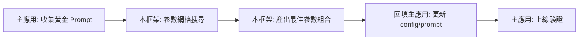

# 🔬 LLM Parameter Tuning Framework for TCM Tongue Diagnosis

> 自動化搜尋最佳 LLM 推理參數（Prompt + Temperature + Top-P）的實驗框架，專為中醫舌診場景設計。
> 
> ⚠️ **本專案為「參數調優工具」，需搭配主應用系統使用**：
> - 主應用： `https://github.com/FJCU-AI-APPLICATION/Tongue-Diagnosis` 
> - 本框架輸出的最佳參數，可回填至主應用的 `assets/config/` 或 `prompts/` 目錄

## 🎯 核心功能
- ✅ **網格搜尋**：自動測試多組 Prompt × Temperature × Top-P 組合
- ✅ **穩定性評估**：動態重複推論 + Jaccard 相似度計算
- ✅ **混合評分**：規則檢查（術語覆蓋/格式）+ LLM-as-a-Judge（因果邏輯/語言適切）
- ✅ **實驗追蹤**：自動產出 CSV 報告 + 原始輸出存檔

## 🔄 與主應用系統的協作流程


## 📁 目錄結構

```
├── prompts/
│   ├── v1_doctor.txt           # 醫生原版 Prompt (同步自主應用)
│   └── 醫生提示詞參考.txt       # 本地實驗用提示詞
├── reports/                    # 實驗報告與分析
├── outputs/                    # 腳本輸出的 CSV 報告與 best_config.yaml
├── experiment_data/            # 各實驗逐筆原始文字輸出
├── .env.example                # 環境變數範本
├── tuning_workflow_sync.py     # 主程式（支援增量實驗）
├── tuning_app.py               # Gradio UI 介面 (開發中)
└── agent_system_prompt.md      # AI Agent 調參專用提示詞
```

## 🚀 快速開始

### 1. 環境需求
- Python 3.11+
- [uv](https://github.com/astral-sh/uv)

### 2. 安裝依賴
```bash
git clone https://github.com/LNSY116/LLM-Tuning-TCM.git
cd LLM-Tuning-TCM
uv sync
```

### 3. 設定 API Key
```bash
cp .env.example .env
# 編輯 .env，填入你的 GEMINI_API_KEY
```

### 4. 準備測試影像
將你的舌診照片放入專案根目錄，並修改 `tuning_workflow_sync.py` 頂部的：
```python
IMAGE_PATH = "MyTongue.jpg"  # ← 改成你的檔名
```

### 5. 執行實驗
```bash
uv run tuning_workflow_sync.py
```

## 📊 Prompt 版本說明 (`prompts/`)

| 版本 | 描述 |
|---|---|
| **V1 醫生原版** | 完整專業術語，涵蓋所有診斷維度 |
| **V2 CoT 版** | 要求輸出思考過程，提升可解釋性 |
| **V3 精簡版** | 去除客套話，直接條列輸出，一致性最高 |

## 📜 授權
MIT License
