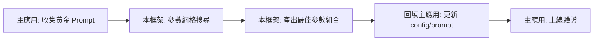

# 🔬 LLM 參數調優框架 — 中醫舌診專用

自動化搜尋最佳推理參數（Prompt + Temperature + Top‑P），專為中醫舌診場景設計。本專案為「參數調優工具」，需搭配主應用系統使用（例如：https://github.com/FJCU-AI-APPLICATION/Tongue-Diagnosis）。本框架輸出的最佳參數可回填到主應用的 `assets/config/` 或 `prompts/`。

## 🎯 核心功能
- 網格搜尋：自動測試多組 Prompt × Temperature × Top‑P 組合
- 穩定性評估：動態重複推論並以 Jaccard 相似度評估一致性
- 混合評分：規則檢查（術語覆蓋 / 格式）+ LLM 作為評審（語言適切性 / 因果邏輯）
- 實驗追蹤：自動產出 CSV 報告，並保存原始推論輸出

## 🔄 與主應用系統的協作流程


## 📁 目錄結構（簡要）

```
├── prompts/                    # Prompt 範本 (e.g., v1_doctor.txt)
├── reports/                    # 實驗報告與分析
├── outputs/                    # 腳本輸出 CSV 與 best_config.yaml
├── experiment_data/            # 各實驗的原始輸出
├── .env.example                # 環境變數範本
├── tuning_workflow_sync.py     # 主程式 (支援增量實驗)
├── tuning_app.py               # Gradio UI（開發中）
└── agent_system_prompt.md      # 用於自動化調參的系統提示詞
```

## 🚀 快速開始

### 1. 環境需求
- Python 3.11+
- 建議安裝工具 `uv`（或改用其他執行方式）：https://github.com/astral-sh/uv

### 2. 安裝依賴
```bash
git clone https://github.com/LNSY116/LLM-Tuning-TCM.git
cd LLM-Tuning-TCM
# 若使用 pip
pip install -r requirements.txt
# 若使用 uv（請先安裝 uv）
uv sync
```

### 3. 設定 API Key
```bash
cp .env.example .env
# 編輯 .env，填入必要變數，例如 GEMINI_API_KEY
```

### 4. 準備測試影像
- 將舌診照片放在專案根目錄，並在 `tuning_workflow_sync.py` 頂部設定：
```python
IMAGE_PATH = "MyTongue.jpg"
```

### 5. 執行實驗
- 使用 `uv`：
```bash
uv run tuning_workflow_sync.py
```
- 或直接用 Python：
```bash
python tuning_workflow_sync.py
```

## 📊 Prompt 版本說明 (`prompts/`)

| 版本 | 描述 |
|---|---|
| **V1 醫生原版** | 完整專業術語，涵蓋所有診斷維度 |
| **V2 CoT** | 要求輸出思考過程，提高可解釋性 |
| **V3 精簡版** | 去除冗詞，條列輸出，一致性較高 |

## 範例輸出
- `outputs/`：CSV 實驗報告、`best_config.yaml`（最佳參數）
- `experiment_data/`：每次實驗的原始 LLM 輸出

## 建議新增項目（可選）
- 在 `pyproject.toml` 或新增 `requirements.txt` 明確列出依賴版本
- 在 `.env.example` 補上各欄位說明與是否必填
- 加入「如何貢獻」與聯絡資訊（PR/Issue 指引）

## 📜 授權
MIT License
