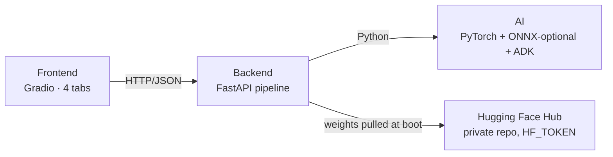

# Tongue Diagnosis

Local-first proof-of-concept for AI tongue analysis: upload or capture a tongue photo → run PyTorch ResNet50 classifiers → produce a Traditional Chinese Medicine doctor comment via Gemini under a locked, rule-bound system prompt.



## Layout

Single uv project; three top-level src-layout packages. Frontend talks to backend over HTTP only — no Python imports across the boundary.

```
src/
├── ai/        → wheel package `ai`        (PyTorch + huggingface_hub + cv2)
├── backend/   → wheel package `backend`   (FastAPI + Google ADK + pyyaml + pydantic-settings)
└── frontend/  → wheel package `frontend`  (Gradio 4 + httpx)

assets/
├── config/    → llm.{default,current}.yaml, registry.{default,current}.yaml
├── prompts/   → system.{default,current}.md
└── secrets/   → local API keys (gitignored)

tests/{ai,backend,frontend}/   one pytest run for the whole repo
```

## Prerequisites

- [uv](https://docs.astral.sh/uv/)
- Python 3.11+
- A Hugging Face access token (`HF_TOKEN`) with read access to the weights repo
- Google Cloud credentials for ADK / Vertex AI Gemini — `gcloud auth application-default login` or a service-account JSON via `GOOGLE_APPLICATION_CREDENTIALS`

## Quick start

```bash
# 1. Install (CPU PyTorch by default; see "GPU" below to switch)
uv sync --all-extras

# 2. Configure — create `.env` at repo root with at least:
#     HF_TOKEN=hf_your_token_here
#   Optionally:
#     GOOGLE_APPLICATION_CREDENTIALS=/abs/path/to/service-account.json
#     BACKEND_HOST=0.0.0.0          # default 127.0.0.1
#     BACKEND_PORT=8000             # default 8000
#     GRADIO_SERVER_NAME=0.0.0.0
#     GRADIO_SERVER_PORT=7860

# 3. Run the backend (port 8000) — first boot pulls ~190 MB of weights from HF Hub
export $(grep -v '^#' .env | xargs)
uv run uvicorn backend.app:app --port 8000   # or: uv run tongue-backend

# 4. Run the Gradio UI (port 7860) — separate terminal
uv run python -m frontend.app                # or: uv run tongue-frontend
# open http://localhost:7860
```

## API

| Method | Path | Purpose |
|---|---|---|
| `GET`  | `/health` | Liveness, AI version, registry summary (`heads_loaded`) |
| `POST` | `/api/analyze` | Multipart `file=…` → `{user_message, heads, comment, disclaimer, category_map, timing_ms}` |
| `GET`  | `/api/config/{section}` | Read raw text — `section` is `prompt` / `llm` / `registry` |
| `PUT`  | `/api/config/{section}` | Save (validates: temperature/max_tokens/top_p ranges, registry YAML structure) |
| `POST` | `/api/config/{section}/reset` | Restore the shipped default |
| `POST` | `/api/config/registry/reload` | Rebuild the live `Registry` (downloads any new HF weights, reloads PyTorch sessions) |

The `/api/analyze` response shape:

```json
{
  "user_message": "本次舌診判讀結果：\n\n- 舌色：淡紅（0.78）\n- 舌下絡脈：怒張（0.72）\n\n請依規則輸出大眾版報告。",
  "heads": [
    {"task": "front",      "head_type": "single", "predictions": [{"label": "淡紅", "score": 0.78}]},
    {"task": "sublingual", "head_type": "single", "predictions": [{"label": "怒張", "score": 0.72}]}
  ],
  "comment":  "## 主要中醫體質\n…",
  "disclaimer": "此為AI自動生成，不具醫療建議。…",
  "category_map": {"front": {"淡紅": "舌色", …}, "sublingual": {"怒張": "舌下絡脈", …}},
  "timing_ms":   {"decode": 4, "detect": 0, "infer": 561, "llm": 1840, "total": 2407}
}
```

## Models

The default registry (`assets/config/registry.default.yaml`) ships **two PyTorch ResNet50 composite heads** served from a Hugging Face Hub repo:

| Head | Classes | v4 categories covered (via `category_map`) |
|---|---|---|
| `front`      | 14 (淡紅, 紅, 淡, 絳, 青紫, 暗, 微紅, 胖大, 瘦薄, 嫩, 偏斜, 齒痕, 無異常, 瘀血絲) | 舌色 · 舌質 · 舌態 · 舌下絡脈 |
| `sublingual` | 3  (怒張, 曲張, 囊柱囊泡) | 舌下絡脈 |

The `category_map` block in the registry YAML projects each predicted class back to its v4 schema category, so the per-request user message emits one bullet per category — never the raw head names. Cross-head predictions for the same category merge automatically (e.g. `front: 瘀血絲` and `sublingual: 怒張` both land under one `舌下絡脈` bullet).

### Adding more heads

Each head in `registry.default.yaml` (or your edited `registry.current.yaml`) supplies **exactly one** of:

- `weights_uri: hf:owner/repo/file.pth`  → resolved via `huggingface_hub.hf_hub_download`, honours `HF_TOKEN`
- `weights_uri: local:relative/path.pth` → resolved relative to the YAML's directory
- `onnx_path:   ../../ai/models/x.onnx` → loaded via `onnxruntime.InferenceSession`

Mix and match. After editing, hit **Apply & Reload Models** in Tab 4 (or `POST /api/config/registry/reload`).

## Configuration plane

Three editable sections, each with a shipped `*.default.*` and a gitignored `*.current.*` overlay. The UI (Tabs 2-4) and the `/api/config/*` endpoints read/write the `*.current.*` files; **Reset** restores from default.

| Section  | File | What's in it |
|---|---|---|
| `prompt`   | `assets/prompts/system.{default,current}.md`     | Locked 大眾版 Gemini system prompt — 9 證素 lookup, mandatory 5-section output, disclaimer text |
| `llm`      | `assets/config/llm.{default,current}.yaml`         | `model`, `temperature` (0–2), `max_tokens` (>0), `top_p` (0–1) |
| `registry` | `assets/config/registry.{default,current}.yaml`    | Heads + `category_map` |

## Environment variables

All have sensible defaults; override only when needed.

| Var | Default | Used by | Purpose |
|---|---|---|---|
| `HF_TOKEN`                    | —                          | backend  | Read access to the private weights repo |
| `GOOGLE_APPLICATION_CREDENTIALS` | —                       | backend  | ADK / Vertex AI auth (alternative: `gcloud auth application-default login`) |
| `TONGUE_BACKEND_URL`          | `http://localhost:8000`    | frontend | Where the Gradio app talks to FastAPI |
| `TONGUE_BACKEND_TIMEOUT`      | `60`                       | frontend | httpx timeout in seconds |
| `TONGUE_MAX_UPLOAD_MB`        | `10`                       | backend  | Cap for `/api/analyze` uploads |
| `GRADIO_SERVER_NAME`          | `0.0.0.0`                  | frontend | Gradio bind interface (`127.0.0.1` to restrict to local) |
| `GRADIO_SERVER_PORT`          | `7860`                     | frontend | Gradio port |

## Smoke test (manual end-to-end)

Run before every merge to `main`. Assumes the prerequisites above.

1. `uv sync --all-extras`
2. **Terminal A:** `uv run uvicorn backend.app:app --port 8000`
   - Watch for `Loaded N heads` — should be 2 with the default registry.
3. **Terminal B:** `uv run python -m frontend.app` → open <http://localhost:7860>
4. **Tab 1 — 舌診分析:** upload a tongue photo, click **分析**. Expect:
   - Two rows in the heads dataframe (`front`, `sublingual`).
   - Markdown comment with sections 主要中醫體質 / 次要中醫體質 / 體質說明 / 證素列表 / 警語.
   - Disclaimer visible.
   - Advanced panel shows the `user_message` (with **v4-category bullets** — 舌色, 舌質, 舌態, 舌下絡脈 — *not* the raw head names) and `timing_ms`.
5. **Tab 2 — 提示詞設定:** trim prompt to a one-liner → **儲存** → re-run analyze → comment changes. **還原預設** to revert.
6. **Tab 3 — LLM 設定:** drop `temperature` to `0.0` → **儲存** → re-run; expect roughly identical output across two runs.
7. **Tab 4 — 模型設定:** append `.bad` to one head's `weights_uri` → **儲存** → **Apply & Reload Models** → expect that head listed under `failed`. **還原預設** + **Apply & Reload Models** to restore.
8. **Failure path:** stop backend mid-flow → frontend shows `無法連線到後端`.
9. **Empty input:** click **分析** with no image → frontend shows `請選擇或拍攝照片`.

If the UI gets you stuck, recover by deleting the `*.current.*` files under `assets/{prompts,config}/` and restarting the backend.

## Training (optional)

Cleaned-up retraining scripts for the two composite heads, behind the `[training]` extra (adds `scikit-learn` + `matplotlib`):

```bash
uv sync --all-extras

uv run --extra training python -m ai.training.train_front \
    --labels-json data/labels.json \
    --img-dir     data/images/ \
    --weights-out weights/best_resnet50_front.pth \
    --epochs 15

uv run --extra training python -m ai.training.train_sublingual \
    --labels-json data/labels.json \
    --img-dir     data/images/ \
    --weights-out weights/best_resnet50_sublingual.pth
```

Labels JSON is in Label Studio export format. After training, upload the new `.pth` to your HF Hub repo (or point `weights_uri` at `local:weights/…`) and reload the registry.

## GPU support

Switch the PyTorch index in the root `pyproject.toml`:

```toml
[[tool.uv.index]]
name = "pytorch-cpu"
url = "https://download.pytorch.org/whl/cu124"   # CUDA 12.4
explicit = true
```

Then:

```bash
uv sync --all-extras --reinstall-package torch --reinstall-package torchvision
```

The backend autodetects `cuda` > `mps` > `cpu`.

## Tests

```bash
uv sync --all-extras
uv run pytest
# 128 passed
```

## Development tips

```bash
# Run a quick sanity check
uv run python -c "import ai; print(ai.__version__)"

# Add a dependency
uv add <dependency>

# Reload models from the running backend (no restart needed)
curl -X POST http://localhost:8000/api/config/registry/reload
```
