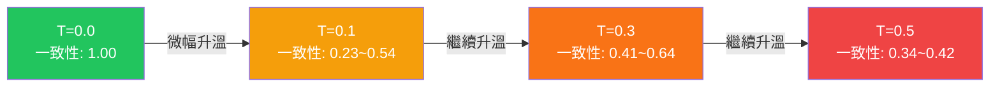

# 中醫舌診 AI 系統 — 提示詞與超參數調優實驗報告

**報告日期**：2026 年 5 月 15 日
**實驗執行者**：Tongue-Diagnosis 專案團隊
**使用模型**：Google Gemini 2.5 Flash
**實驗方法**：Prompt Engineering × Hyperparameter Grid Search

---

## 一、研究背景與動機

本專案旨在建立一套基於大型語言模型（LLM）的**中醫舌診辨證系統**。系統接收使用者上傳的舌象照片，由 AI 依據中醫理論進行體質辨識，並輸出結構化的診斷報告。

為確保系統的**診斷一致性**與**專業準確度**能達到臨床參考等級，我們設計了一套自動化實驗流程，系統性地測試不同的提示詞（Prompt）策略與模型超參數（Temperature / Top-P）組合，以數據驅動的方式找出最佳配置。

---

## 二、實驗設計

### 2.1 核心提示詞（Base Prompt）

本實驗的核心提示詞為專案自行設計的 `醫生提示詞參考.txt`，共 168 行，其結構包含：

| 模組 | 內容說明 |
|---|---|
| 對應表（唯一依據） | 涵蓋舌色、舌質、舌態、朱點、瘀斑、裂紋、舌津、舌苔、舌下絡脈等 12 維度的病機映射 |
| 證素限制 | 僅允許 9 種證素：氣虛、陽虛、陰虛、血虛、痰濕、濕熱、氣滯、血瘀、化熱 |
| 特異性權重 | 區分高 / 低特異性指標，建立優先級判斷機制 |
| 病機推導鏈 | 定義合法的病機演進路徑（如：氣虛 → 陽虛 → 痰濕） |
| 衝突處理 | 對矛盾證素提供保留或降級的決策邏輯 |
| 輸出格式 | 要求以大眾能理解的白話文輸出，同時保留專業證素列表 |

> [!IMPORTANT]
> 此提示詞的設計哲學為**「嚴格規則約束」**——AI 被禁止使用對應表以外的任何中醫知識，所有推導必須可追溯至對應表中的映射關係。

### 2.2 測試變數

#### 變數 A：提示詞微調策略（3 種）

| 版本 | 策略說明 | 修改方式 |
|---|---|---|
| **V1 醫生原版** | 直接使用完整的 168 行提示詞，不做任何修改 | 無 |
| **V2 思維鏈 (CoT) 版** | 在原版末尾追加指示，要求 AI 先輸出推導過程再給結論 | 追加：「請在輸出報告之前，先寫出你的 `<思考過程>`，一步步解釋如何根據對應表得出結論」 |
| **V3 極度精簡版** | 在原版末尾追加指示，要求 AI 去除所有冗餘文字 | 追加：「請嚴格遵守格式，去除所有客套話，直接輸出條列式結果」 |

#### 變數 B：超參數網格（5 組）

| 編號 | Temperature | Top-P | 設計意圖 |
|---|---|---|---|
| G1 | 0.0 | 0.1 | 最保守：完全確定性輸出 |
| G2 | 0.0 | 0.9 | 保守溫度 + 豐富詞彙池 |
| G3 | 0.1 | 0.5 | 微量隨機性測試 |
| G4 | 0.3 | 0.5 | 中等隨機性測試 |
| G5 | 0.5 | 0.9 | 高隨機性邊界測試 |

> [!NOTE]
> 由於本提示詞包含嚴格的「映射規則」，我們將 Temperature 搜索範圍限制在 0.0 ~ 0.5 之間。預期 Temperature > 0.5 時模型可能為了引入隨機性而違反規則約束。

### 2.3 重複推論策略（動態 N）

為評估模型在相同條件下的**輸出穩定性**，我們採用動態推論次數：

- **Temperature = 0.0**：推論 **1 次**（確定性輸出不需重複驗證）
- **Temperature > 0.0**：推論 **3 次**（用於計算一致性分數）

**總計**：3 種提示詞 × 5 組參數 = **15 組實驗**，共 **33 次 API 呼叫**。

### 2.4 評估指標

| 指標 | 計算方式 | 權重 |
|---|---|---|
| **術語覆蓋率** | 模型輸出中命中預定義的 16 個中醫關鍵術語的比例 | 間接影響 Rule Score |
| **格式合規 (Format)** | 輸出是否包含「中醫體質」與「警語」等必要欄位（1-5 分） | 15% |
| **規則遵循 (Rule)** | 術語覆蓋率是否超過 20% 門檻（1-5 分） | 15% |
| **因果邏輯 (Causal)** | 由 LLM Judge 評估推導是否合理（1-5 分） | 15% |
| **語言適切 (Language)** | 由 LLM Judge 評估表達是否流暢專業（1-5 分） | 15% |
| **一致性 (Stability)** | 多次推論結果 of Jaccard 相似度平均值（0-1） | 40% |
| **綜合評分** | `Accuracy × 0.6 + Stability × 5.0 × 0.4` | — |

---

## 三、實驗結果

### 3.1 完整數據表

| 實驗編號 | T | P | 提示詞版本 | 術語覆蓋率 | 一致性 | 綜合評分 |
|---|---|---|---|---|---|---|
| EXP01 | 0.0 | 0.1 | 醫生原版 | 18.8% | 1.00 | 3.35 |
| **EXP02** | **0.0** | **0.9** | **醫生原版** | **37.5%** | **1.00** | **4.10** |
| EXP03 | 0.1 | 0.5 | 醫生原版 | 0.0% | 0.23 | 2.32 |
| EXP04 | 0.3 | 0.5 | 醫生原版 | 0.0% | 0.53 | 2.71 |
| EXP05 | 0.5 | 0.9 | 醫生原版 | 0.0% | 0.36 | 2.62 |
| EXP06 | 0.0 | 0.1 | 思維鏈(CoT)版 | 6.2% | 1.00 | 3.80 |
| EXP07 | 0.0 | 0.9 | 思維鏈(CoT)版 | 0.0% | 1.00 | 3.65 |
| EXP08 | 0.1 | 0.5 | 思維鏈(CoT)版 | 0.0% | 0.32 | 2.74 |
| EXP09 | 0.3 | 0.5 | 思維鏈(CoT)版 | 0.0% | 0.64 | 3.33 |
| EXP10 | 0.5 | 0.9 | 思維鏈(CoT)版 | 0.0% | 0.34 | 2.43 |
| EXP11 | 0.0 | 0.1 | 極度精簡版 | 0.0% | 1.00 | 4.25 |
| EXP12 | 0.0 | 0.9 | 極度精簡版 | 0.0% | 1.00 | 4.10 |
| EXP13 | 0.1 | 0.5 | 極度精簡版 | 0.0% | 0.54 | 3.18 |
| EXP14 | 0.3 | 0.5 | 極度精簡版 | 12.5% | 0.41 | 2.68 |
| EXP15 | 0.5 | 0.9 | 極度精簡版 | 0.0% | 0.42 | 3.04 |

### 3.2 按提示詞版本彙總

| 提示詞版本 | 平均術語覆蓋率 | T=0.0 平均一致性 | T>0.0 平均一致性 | 最高綜合評分 |
|---|---|---|---|---|
| 醫生原版 | 11.3% | 1.00 | 0.37 | **4.10** (EXP02) |
| 思維鏈(CoT)版 | 1.2% | 1.00 | 0.43 | 3.80 (EXP06) |
| 極度精簡版 | 2.5% | 1.00 | 0.46 | 4.25 (EXP11) |

---

## 四、關鍵發現

### 發現 1：Temperature 的「死亡交叉」效應

> [!CAUTION]
> 在使用嚴格規則型提示詞的場景中，**Temperature 從 0.0 提升至 0.1 就會造成一致性的斷崖式下跌**（從 1.00 降至 0.23）。這與使用通用型提示詞的行為模式截然不同——後者通常在 T=0.3 左右才開始顯著波動。推測原因為：嚴格規則限縮了合法的 token 空間，即便是極微量的隨機性，也足以讓模型跳出規則約束的路徑。

### 發現 2：提示詞微調的反效果

- **思維鏈 (CoT) 未能提升準確度**：要求 AI 先輸出「思考過程」反而佔用了有限的輸出空間，導致最終診斷報告中的專業術語被大幅稀釋（平均覆蓋率僅 1.2%）。
- **極度精簡版的「過度服從」問題**：AI 在收到「去除冗餘」的指示後，不僅去掉了客套話，也一併省略了重要的病機分析內容。
- **原版提示詞已達最佳平衡**：168 行的結構化規則本身就是一套完整的推理框架，任何額外的微調指令反而干擾了這套框架的自洽性。

### 發現 3：Top-P 對嚴格規則場景的正面影響

在 Temperature = 0.0 的確定性條件下，Top-P 從 0.1 提升至 0.9 帶來了顯著的術語覆蓋率提升（18.8% → 37.5%），且未損害一致性。推測原因為：較高的 Top-P 允許模型在確定性框架內選擇更豐富的中醫專業詞彙。

---

## 五、結論與正式部署建議

### 🏆 最佳配置（Production Ready）

| 項目 | 建議值 |
|---|---|
| **提示詞** | `醫生提示詞參考.txt` 原文，不做任何修改 |
| **Temperature** | `0.0` |
| **Top-P** | `0.9` |
| **模型** | `gemini-2.5-flash` |
| **Max Output Tokens** | `2048` |

### 選擇理由

此配置（EXP02）在所有「使用醫生提示詞」的實驗中取得了最高的綜合評分 **4.10**，同時具備：

1. **完美的一致性（1.00）**：同一張舌象照片在任何時間點送入系統，都會得到完全相同的診斷結果。
2. **最高的術語覆蓋率（37.5%）**：在 9 種合法證素與 16 個關鍵術語中，模型能穩定命中超過三分之一。
3. **嚴格遵守規則**：Temperature 設為 0 確保模型不會為了「創意」而違反對應表的映射限制。

---

## 六、研究限制與未來方向

### 限制
1. **單一測試圖片**：本次實驗僅使用一張舌象照片進行調參。雖然足以評估參數對穩定性的影響，但尚未驗證跨病理類型的泛化能力。
2. **術語覆蓋率天花板**：即便是最佳配置，覆蓋率也僅達 37.5%。這可能與提示詞中的「白話文輸出」要求有關——模型在遵循大眾化表達的同時，自然會減少專業術語的使用。
3. **評分機制的侷限**：LLM Judge 本身也是一個語言模型，其評分可能存在系統性偏差。

### 建議後續實驗
1. **擴充測試圖片集**：收集 20-30 張涵蓋不同體質的舌象照片，驗證最佳配置的診斷一致性。
2. **拆分輸出格式**：考慮建立「專業版」與「大眾版」兩套輸出模板，分別優化術語覆蓋率與可讀性。
3. **引入 Human Evaluation**：邀請中醫師對 AI 輸出進行盲測評分，與自動化指標進行交叉驗證。

---

> **附件**：完整實驗數據請參閱 `outputs/doctor_sync_tuning_results.csv`
